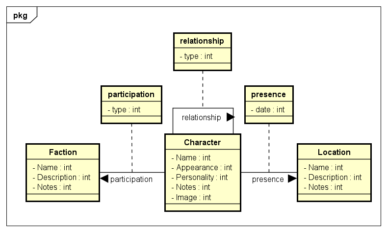

# Notes Project
## Video Demo: [\[<URL HERE>\]](https://www.youtube.com/watch?v=XlSEugu7NHU)
### Description:
This is my final project for CS50's Introduction to Computer Science course. The idea behind this project was to create an application that helps with worldbuilding by managing and visualizing characters, locations, groups, and the relationships between them. The application is designed to allow users to create nodes (representing entities such as characters or places) with properties, as well as establish relationships between nodes via edges.

The app is built as a web application for managing and visualizing graph data. It allows users to visually explore the relationships between entities, enabling them to track connections and interact with nodes in real-time. With the power of Cytoscape.js, users can visualize these relationships dynamically. On the backend, Flask serves as the API framework, handling data processing and storage. The graph structure itself is powered by Neo4j, a graph database that efficiently handles nodes and their relationships.

One of the standout features of the project is the interactive graph visualization. Cytoscape.js provides a highly customizable graph visualization, allowing users to explore and manipulate nodes and edges intuitively. The graph visualization is designed to display a network of nodes (entities) and edges (relationships) that connect them. Clicking on a node reveals detailed information about that particular entity, such as its properties, associated edges, and relationships with other nodes.

### Features:
The application offers several key features to help users organize and manage their nodes and relationships:

- Node Management: Users can create and manage nodes with customizable labels and properties. Each node can have any number of edges that connect it to other nodes, forming a complex web of interconnected data. Nodes are also editable, allowing users to update existing entities with new properties or relationships.

- Interactive Graph Visualization: The application leverages Cytoscape.js to provide an interactive graph where users can drag and organize nodes. Each node represents an entity, while the edges represent the relationships between those entities. Nodes and edges can be clicked to reveal additional information.

- Edge Creation: Users can create relationships (edges) between nodes, specifying properties for each edge. This functionality is essential for linking different parts of the graph, allowing users to build complex and meaningful networks of data.

- Autocomplete Search: The app includes an autocomplete feature for quickly searching for nodes. As users type into the search box, matching nodes are displayed, allowing for rapid navigation within the application.

- Data Persistence: The data (nodes and edges) created and modified within the app is saved to a Neo4j database. This ensures that users’ changes persist across sessions, allowing for long-term tracking and management of entities.

### Technologies Used:
This project integrates several key technologies to achieve its goals:

#### Frontend:
- Cytoscape.js: This powerful library is used for rendering and visualizing graphs. It allows users to interact with nodes and edges, offering a rich set of features for customization, animation, and data-driven layout management.
- Bootstrap: A responsive front-end framework that ensures the application is mobile-friendly and aesthetically pleasing. It helps structure the user interface with predefined CSS classes for elements like buttons, forms, and tables.
- jQuery: Used for DOM manipulation and handling AJAX requests, enabling smooth user interactions and dynamic content loading.

#### Backend:
- Flask: A lightweight Python web framework that handles requests, serves templates, and manages data storage. It provides a flexible structure for building APIs and handling user interactions on the server-side.
- Neo4j: A graph database that stores nodes and edges. It is optimized for graph-based data storage and querying, making it the ideal choice for this project, where relationships between entities are central.
- Docker: Docker containers are used to simplify deployment and create a consistent development environment. The application runs within containers for both the Flask app and Neo4j database, ensuring seamless setup and execution across different environments.

### Running the Application:
1. Ensure Docker is installed: Make sure that Docker and Docker Compose are installed on your machine.

2. Clone the repository

3. Run Docker Compose: In the main project directory, run the following command to bring up both the Neo4j and Flask containers: docker-compose up

4. Access the Application: After running Docker Compose, the application will be accessible via localhost:8000.

### How to Use:
- Create a Node:
The application starts with no nodes. To create a node, simply use the form on the right-hand side and click the "Save" button.
To create a new node without affecting an active one, leave the search box at the top of the page empty and submit the form.
- Active Node:
To open a node and view or update it, use the search box at the top of the page to search for a node.
Alternatively, click on a node in the graph to activate it and view its details.
- Edit Node:
Users can update a node's label, name, properties, and edges. After making the changes, simply click the "Save" button to save the updated information.
- Add Properties and Edges:
For each node, you can add properties (key-value pairs) and establish relationships (edges) to other nodes. Each edge can also have its own properties.
- View the Graph:
The graph is displayed interactively using Cytoscape.js, enabling users to organize and explore nodes and edges. Users can drag nodes around to adjust the layout, and clicking on a node reveals detailed information about it.

### Design:
The design of the application was chosen to create a light, "papery" aesthetic that feels clean and organized. This aesthetic is meant to evoke the feeling of note-taking in a digital format, similar to working with physical papers and notes. Light tones and subtle colors contribute to a soft, non-distracting environment where users can focus on creating and managing their graph data.